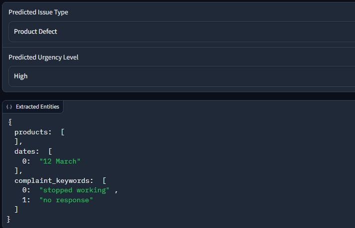

<div align="center">

# 🧾 Customer Support Ticket Classifier & Entity Extractor
### An end-to-end ML and NLP pipeline that classifies customer support tickets 
</div>

---

Built using traditional NLP techniques, scikit learn models, and rule based entity extraction ~ which are all connected through a gradio app.

##  Demo Video

▶️ **CLICK HERE👇**

[](https://youtu.be/QeQ2JdWP4xA)
---

## Project Overview

This project processes raw customer support tickets and provides:  

- **Issue type classification** (eg: product defect, late delivery)
- **Urgency level prediction** (eg: low, medium, high)  
- **Entity extraction** of product names, dates, and complaint keywords  
- Interactive user input and output through a **Gradio web interface**
- pipeline that uses a combination of **traditional NLP preprocessing**, **ML classifiers**, and **custom rule-based entity extraction**.

## How to Run the Project in Google Colab

### 1. Open the Colab Notebook

Open the Colab notebook file (NLP_customer_ticket_pipeline.ipynb) in Google Colab.

### 2. Run the First cell to install dependencies

Run the first cell, it contains all necessary imports

### Install packages (if needed)
```bash
!pip install pandas scikit-learn gradio openpyxl
```
### 3. Upload the provided dataset

Option 1: Upload dataset manually

```bash
from google.colab import files
uploaded = files.upload()  # Upload tickets_complex_1000_dataset.xls here
```
Option 2: Mount your Google Drive if your have stored dataset there:

```bash
from google.colab import drive
drive.mount('/content/drive')
data_path = '/content/drive/MyDrive/tickets_complex_1000_dataset.xls'
```

### 4. Run Data preprocessing and training cells

Run the notebook cells one by one sequentially

### 5. Launch the Gradio App

Run the cell that starts the Gradio interface

The app will start and provide a local interface directly in the Colab output (also a clickable link like this: https://localhost:7863/)

---

## Architecture & Workflow

```text
Raw ticket text
↓
Text cleaning &pPreprocessing
↓
Feature engineering (TF-IDF + Numeric features)
↓
ML models for:
• Issue iype classification (Logistic regression)
• Urgency level prediction (Random forest)
↓
Rule based entity extraction:
• Product matching
• Date Extraction (regex)
• Complaint keyword detection (phrase-based)
↓
Output display in Gradio:
• Predicted issue & urgency
• Extracted entities JSON
```

## Tech Stack

* Colab

* python

* pandas, numpy

* nltk (stopwords, lemmatization)

* scikit-learn (LogisticRegression, RandomForestClassifier)

* gradio for ui

* regex for rule-based extraction

## Model Evaluation & Metrics

- Issue Type Classifier: Logistic Regression

- Urgency Level Classifier: Random Forest

Both models were evaluated using:

- Classification Report (precision, recall, F1-score per class)

- Confusion Matrix for error analysis

- 80-20 Train-Test Split to ensure balanced representation

The issue type model achieved strong F1-scores (0.99) for major classes and performed robustly on unseen tickets.
but the urgency type model achieved subpar results (0.40) 

### Conclusion is that we have to use transformer embeddings for better generalisation for urgency levels

## Entity Extraction design choices

- Rule-based approach chosen for:
  -  High precision on domain-specific entitiese
  -  easy customization (adding new complaint phrases)
  -  Handling of informal date formats (eg 19 May, May 19) using regex

- Product extraction done by matching known product names (lookup based).

- Complaint keywords expanded with phrase detection like "days late" and "not working". (dictionary/ domain based)

## ✖️ Limitations & Future Work

- Current model relies on traditional ML; deep learning approaches like transformers could improve accuracy

- Rule-based entity extraction may miss unexpected or novel expressions

- More advanced NLP techniques (eg Named entity recognition) could enhanceentity coverage

- Additional user feedback loop could improve model performance over time

---

## Application Screenshots

### Main Gradio App UI  


### Sample Prediction Output  


---

## CONCLUSION

This project provides great insights on customer support tickets analysis by combining rule-based NLP extraction with robust machine learning classification.
The interactive Gradio app demonstrates the final working of the model.

---

<div align="center">
Thanks, made with 💜 by arnav

</div>
